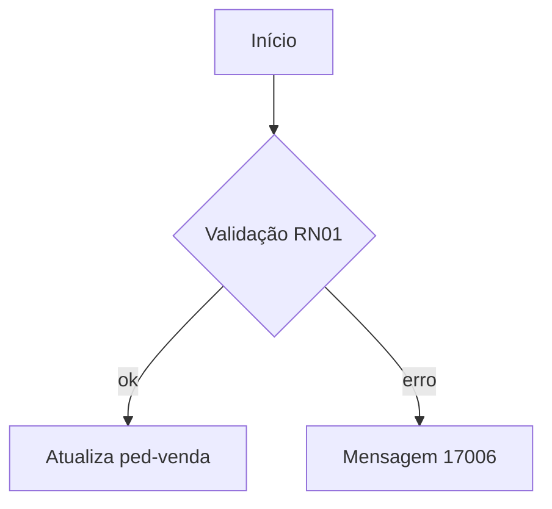

# Modelo de documentação de programa Progress

Copie a estrutura abaixo. Nenhuma seção é removida: se não se aplica, escreva "Não se aplica" e o motivo em uma linha.

````markdown
# <programa> — <título curto>

> Objetivo: <uma frase: o que o programa faz e para quem>.

## Identificação

| Item | Valor |
| --- | --- |
| Fonte principal | `<caminho/programa.p>` |
| Tipo | tela (.w) / batch-relatório / API-BO / UPC-EPC / include / classe |
| Módulo | <sigla e nome, ou [a confirmar]> |
| Versão | <de i-prgvrs.i ou cabeçalho, ou [a confirmar]> |
| Específico do cliente | sim / não |
| Última alteração registrada | <do cabeçalho/histórico, ou [a confirmar]> |

## Entradas e saídas

| Direção | Nome | Tipo | Descrição | Fonte |
| --- | --- | --- | --- | --- |
| INPUT | `p-...` | char | ... | `arq.p:12` |

## Tabelas (matriz CRUD)

| Tabela / buffer | Banco | C | R | U | D | Índice usado | Fonte |
| --- | --- | --- | --- | --- | --- | --- | --- |
| `ped-venda` | mgdis | | x | x | | `ch-pedido` | `arq.p:40,88` |

Temp-tables relevantes: `tt-...` — finalidade em uma linha.

## Includes

| Include | Parâmetros | Finalidade | Fonte |
| --- | --- | --- | --- |

## Chamadas

| Direção | Programa / procedure | Como (RUN, PERSISTENT, AppServer, UPC, PUBLISH) | Quando | Fonte |
| --- | --- | --- | --- | --- |
| chama | `esp/esxx001.p` | RUN | após gravar pedido | `arq.p:120` |
| é chamado por | `xx0100.w` | RUN | botão Processar | `xx0100.w:300` |

## Fluxo principal



## Regras de negócio

| Id | Regra | Fonte |
| --- | --- | --- |
| RN01 | <condição → consequência, em linguagem de negócio> | `arq.p:55-62` |

## Tratamento de erros e mensagens

| Situação | Tratamento | Mensagem ao usuário | Fonte |
| --- | --- | --- | --- |

## Performance

| Id | Severidade | Local | Achado | Sugestão |
| --- | --- | --- | --- | --- |
| P04 | alta | `arq.p:40` | FOR EACH sem índice em `it-pedido` | ... |

## Riscos e dívidas técnicas

- <risco, local e impacto em uma linha>

## Pendências

- [a confirmar] <pergunta objetiva> — responsável provável: <usuário-chave/DBA/time Datasul>
````
