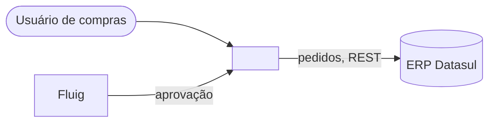
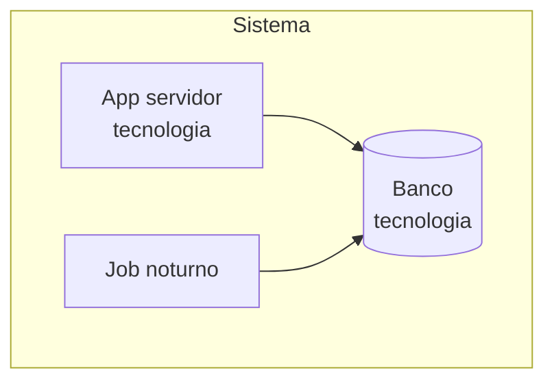
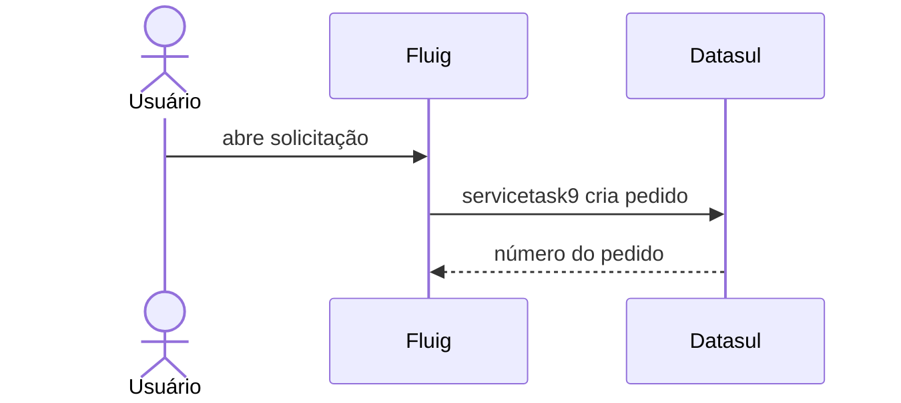

# Modelo de arquitetura técnica (arc42 enxuto + C4)

Copie a estrutura abaixo em `docs/sistemas/<sistema>/arquitetura.md`. Nenhuma seção é removida: se não se aplica, escreva "Não se aplica" e o motivo em uma linha.

````markdown
# Arquitetura — <sistema>

> Objetivo: <uma frase: o que o sistema faz e para quem>.

## 1. Objetivos e restrições

| Tipo | Descrição | Evidência |
| --- | --- | --- |
| Objetivo de negócio | ... | [a confirmar] |
| Restrição técnica | ex.: OpenEdge 11.7, Fluig 1.8 | `arquivo` |

## 2. Contexto (C4 nível 1)



| Ator / sistema externo | Troca | Protocolo / formato | Evidência |
| --- | --- | --- | --- |

## 3. Contêineres (C4 nível 2)



| Contêiner | Tecnologia | Responsabilidade | Comunica com | Evidência |
| --- | --- | --- | --- | --- |

Componentes detalhados: links para `docs/progress/*.md` e `docs/fluig/*.md`.

## 4. Fluxos críticos (runtime)

### 4.1 <Nome do fluxo>



Passos e regras relevantes com a fonte de cada um.

## 5. Implantação

| Ambiente | Servidor lógico | Componentes | Como implanta | Evidência |
| --- | --- | --- | --- | --- |

## 6. Conceitos transversais

- **Segurança:** autenticação, autorização, segredos (sem reproduzir).
- **Erros e logs:** padrão de tratamento, onde loga, o que loga.
- **Integração:** padrão (síncrono/assíncrono, arquivo, API), retentativa, idempotência.
- **Dados:** transações, consistência entre sistemas, expurgo.

## 7. Qualidade e riscos

| Id | Risco | Severidade (alta/média/baixa) | Impacto | Evidência | Mitigação sugerida |
| --- | --- | --- | --- | --- | --- |

## 8. Dívidas técnicas

| Id | Dívida | Local | Custo de manter | Sugestão |
| --- | --- | --- | --- | --- |

## Decisões

Links para `adr/NNNN-*.md`.
````
