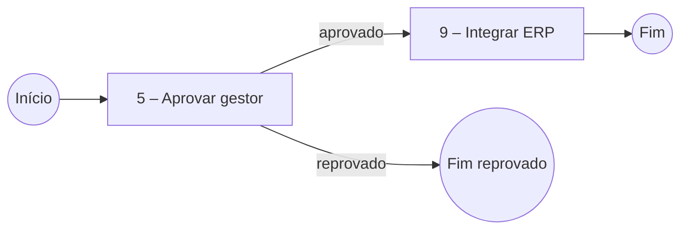

# Modelo de documentação de processo Fluig

Copie a estrutura abaixo. Nenhuma seção é removida: se não se aplica, escreva "Não se aplica" e o motivo em uma linha.

````markdown
# <Nome do processo>

> Objetivo: <uma frase: o que o processo resolve, de onde parte e onde termina>.

## Identificação

| Item | Valor |
| --- | --- |
| Código do processo | `<WKDef / nome do .process>` |
| Versão | <do .process, ou [a confirmar]> |
| Diagrama | `<caminho/processo.process>` |
| Formulário | `<caminho/forms/nome>` |
| Scripts de evento | `<caminho/workflow/scripts/>` |
| Área dona | [a confirmar] |

## Atores

| Papel / grupo / usuário | Atividades | Como é atribuído | Fonte |
| --- | --- | --- | --- |

## Diagrama



## Atividades

| Id – Nome | Tipo | Responsável | Prazo | Eventos/scripts | Regras | Fonte |
| --- | --- | --- | --- | --- | --- | --- |
| 5 – Aprovar gestor | tarefa | grupo `gestores` | 2 dias úteis | `beforeTaskSave` | RN02 | `.process` id 5 |

## Formulário

| Campo | Tipo | Obrigatório em | Editável em | Gravado por script | Fonte |
| --- | --- | --- | --- | --- | --- |
| `valorTotal` | número | 1 | 1 | `afterTaskSave` (atividade 9) | `form.html:40` |

Tabelas pai-filho: `<nome>` — colunas e finalidade.

## Datasets e integrações

| Nome | Tipo (interno/customizado/sincronizado/serviço) | Onde é usado | Constraints / dados trocados | Tratamento de erro | Fonte |
| --- | --- | --- | --- | --- | --- |

## Regras de negócio

| Id | Regra | Atividade | Fonte |
| --- | --- | --- | --- |
| RN01 | <condição → consequência> | 5 – Aprovar gestor | `processo.beforeTaskSave.js:18-30` |

## Tratamento de erros e mensagens

| Situação | Tratamento | Mensagem ao usuário | Fonte |
| --- | --- | --- | --- |

## Performance

| Id | Severidade | Local | Achado | Sugestão |
| --- | --- | --- | --- | --- |

## Riscos e dívidas técnicas

- <risco, local e impacto em uma linha>

## Pendências

- [a confirmar] <pergunta objetiva> — responsável provável: <área dona/time Fluig/integração>
````
