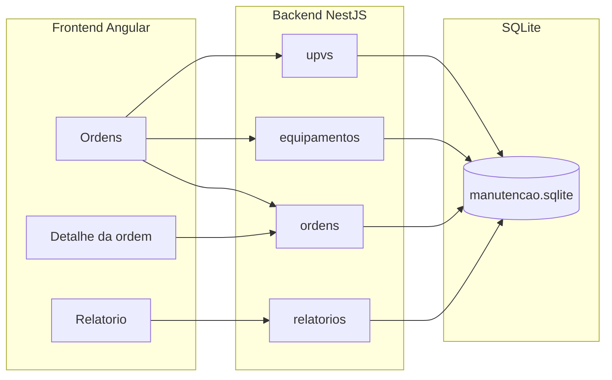

# Arquitetura

Sistema de gestão de ordens de manutenção das usinas (UPVs) da Combio. O frontend Angular consome a API NestJS, que persiste dados em SQLite via TypeORM.

## Módulos da API

- `upvs`: cadastro e consulta de usinas.
- `equipamentos`: cadastro e filtro por UPV.
- `ordens`: ciclo de vida das ordens de manutenção.
- `relatorios`: agregações para o dashboard (ordens por UPV).
