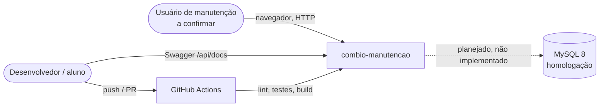
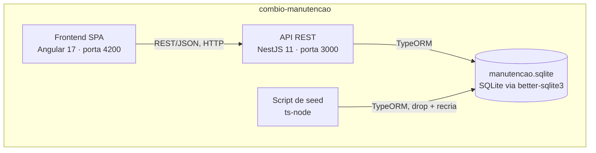
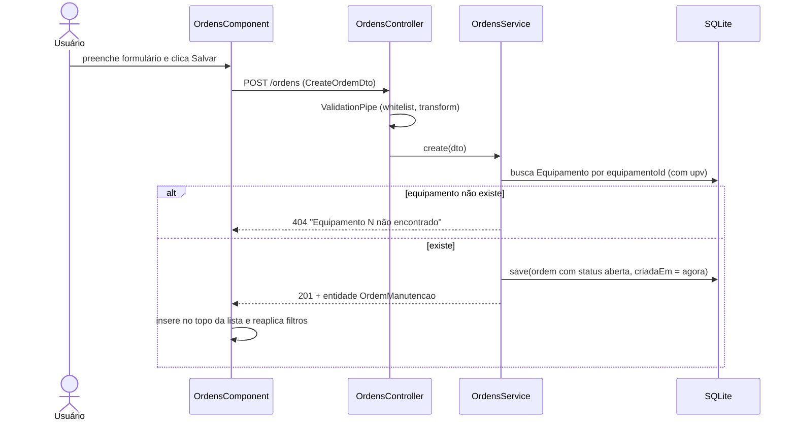
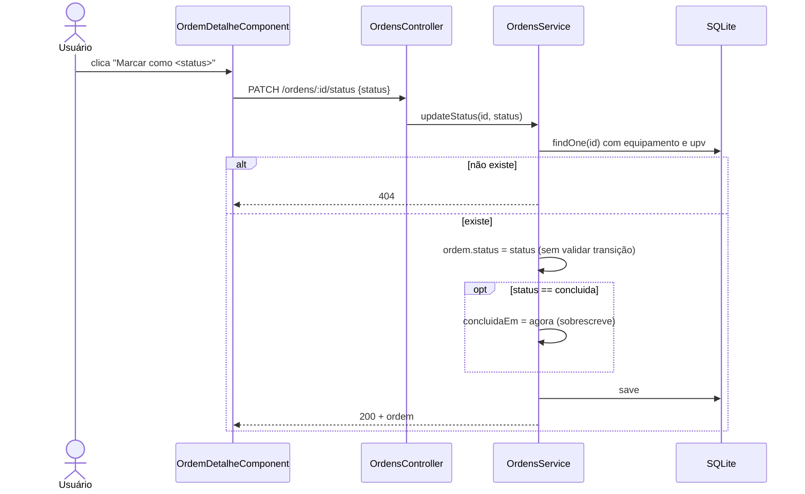
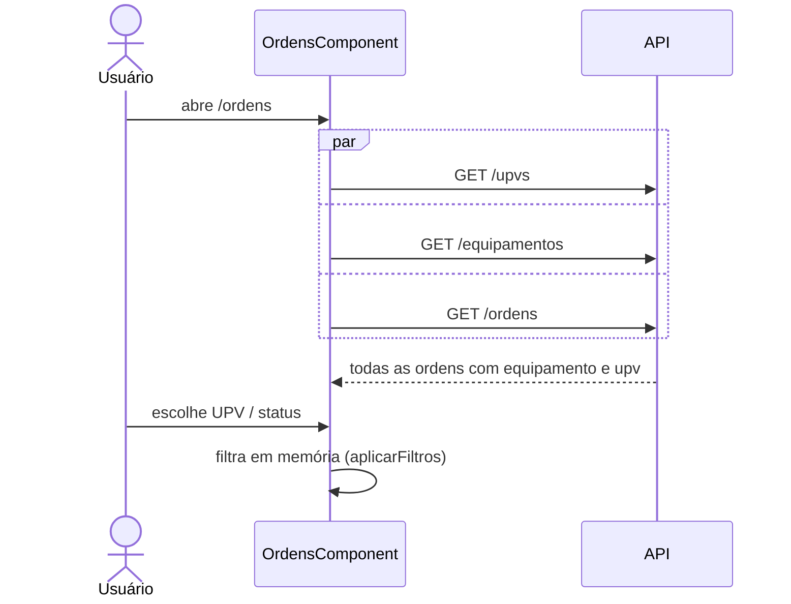
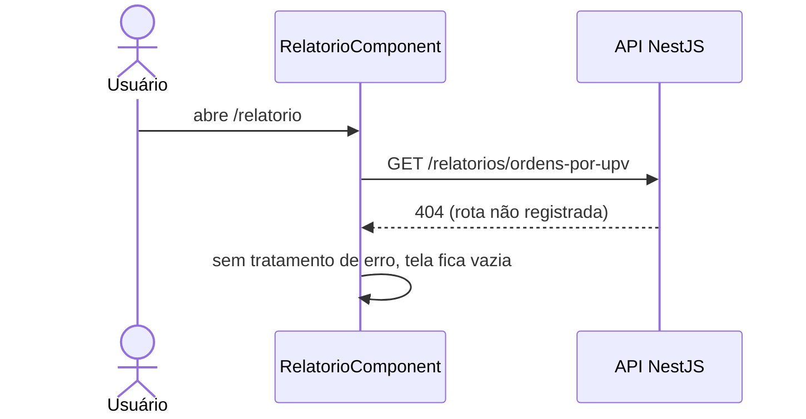
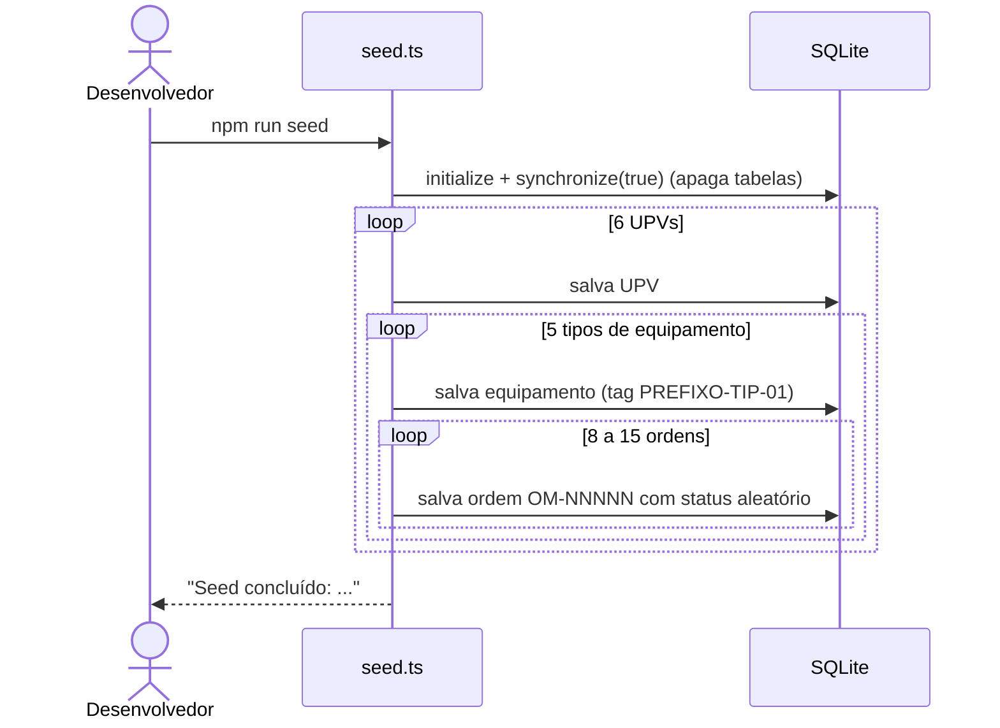

# Arquitetura — combio-manutencao

> Objetivo: registrar e acompanhar ordens de manutenção dos equipamentos das usinas (UPVs) da Combio, para a equipe de manutenção `[a confirmar]`.

## 1. Objetivos e restrições

| Tipo | Descrição | Evidência |
| --- | --- | --- |
| Objetivo de negócio | Gestão de ordens de manutenção de usinas de energia por biomassa | `package.json:5`, `README.md:3` |
| Objetivo de negócio | Uso como material de treinamento (lab de agentes de IA) | `aula/LAB.md:1-3`, `backend/src/config/database.config.spec.ts:41` ("banco de treinamento") |
| Objetivo de negócio | Criticidade, volume real e usuários em produção | [a confirmar] |
| Restrição técnica | Node.js >= 20 (CI usa 24) | `backend/package.json:5-7`, `.github/workflows/ci.yml:19` |
| Restrição técnica | NestJS 11, TypeORM 0.3, `better-sqlite3` 12 | `backend/package.json:20-30` |
| Restrição técnica | Angular 17 (standalone), TypeScript 5.4 no frontend | `frontend/package.json:14-21,47` |
| Restrição técnica | Cobertura mínima de 80% (statements/branches/functions/lines) em backend e frontend | `backend/package.json:74-81`, `frontend/karma.conf.js:23-30` |
| Restrição técnica | Porta da API fixa em 3000; URL da API fixa no frontend | `backend/src/main.ts:25`, `frontend/src/environments/environment.ts:2` |

## 2. Contexto (C4 nível 1)

| Ator / sistema externo | Troca | Protocolo / formato | Evidência |
| --- | --- | --- | --- |
| Usuário de manutenção | Consulta, cria ordens e muda status | HTTP (navegador → Angular → REST/JSON) | `frontend/src/app/app.routes.ts:6-11` |
| Desenvolvedor | Exploração da API | Swagger UI em `/api/docs` | `backend/src/main.ts:17-23` |
| GitHub Actions | Executa `npm ci`, lint, test (e build do frontend) em push/PR para `main` | YAML de workflow | `.github/workflows/ci.yml:3-41` |
| MySQL 8 | Migração planejada; nenhuma conexão no código atual | — | `docs/NOTAS_MIGRACAO.md:1-25`, `backend/src/config/database.config.ts:11` |

Não há integração com ERP, BPM, filas, e-mail ou arquivos de troca: nenhuma URL externa, cliente HTTP de saída ou agendador foi encontrado em `backend/src/`.

## 3. Contêineres (C4 nível 2)

| Contêiner | Tecnologia | Responsabilidade | Comunica com | Evidência |
| --- | --- | --- | --- | --- |
| Frontend SPA | Angular 17 standalone, `HttpClient`, Karma/Jasmine | Telas de ordens, detalhe e relatório | API REST via `environment.apiUrl` | `frontend/src/app/app.config.ts:7`, `frontend/src/environments/environment.ts:2` |
| API REST | NestJS 11 (Express), Swagger, `class-validator` | CRUD de UPVs, equipamentos e ordens | Banco SQLite | `backend/src/app.module.ts:8-17`, `backend/src/main.ts:6-26` |
| Banco | SQLite (`better-sqlite3`), esquema por `synchronize: true` | Persistência das três entidades | — | `backend/src/config/database.config.ts:9-16` |
| Script de seed | `ts-node src/seed.ts` | Apaga e recria o esquema, gera dados sintéticos determinísticos | Banco SQLite | `backend/package.json:17`, `backend/src/seed.ts:99-160` |

### 3.1 Componentes da API

| Módulo | Rotas | Service | Entidade | Evidência |
| --- | --- | --- | --- | --- |
| `upvs` | `GET /upvs`, `GET /upvs/:id`, `POST /upvs` | `UpvsService` | `Upv` | `backend/src/upvs/upvs.controller.ts:18-31` |
| `equipamentos` | `GET /equipamentos?upvId=`, `POST /equipamentos` | `EquipamentosService` | `Equipamento` | `backend/src/equipamentos/equipamentos.controller.ts:11-21` |
| `ordens` | `GET /ordens`, `GET /ordens/:id`, `POST /ordens`, `PATCH /ordens/:id`, `PATCH /ordens/:id/status` | `OrdensService` | `OrdemManutencao` | `backend/src/ordens/ordens.controller.ts:21-47` |
| `relatorios` | `GET /relatorios/ordens-por-upv` | — | — | **Não existe.** Só é chamado pelo frontend: `frontend/src/app/catalogo.service.ts:22-26` |

Não há `PUT`, `DELETE` nem paginação em nenhuma rota.

### 3.2 Componentes do frontend

| Rota | Componente | Serviço / chamadas | Evidência |
| --- | --- | --- | --- |
| `/` | redireciona para `/ordens` | — | `frontend/src/app/app.routes.ts:7` |
| `/ordens` | `OrdensComponent` | `GET /upvs`, `GET /equipamentos`, `GET /ordens`, `POST /ordens` | `frontend/src/app/ordens/ordens.component.ts:162-194` |
| `/ordens/:id` | `OrdemDetalheComponent` | `GET /ordens/:id`, `PATCH /ordens/:id/status` | `frontend/src/app/ordens/ordem-detalhe.component.ts:59-73` |
| `/relatorio` | `RelatorioComponent` | `GET /relatorios/ordens-por-upv` | `frontend/src/app/relatorio/relatorio.component.ts:30-34` |

Tipos compartilhados em `frontend/src/app/models.ts`, mantidos manualmente em espelho das entidades do backend.

## 4. Fluxos críticos (runtime)

### 4.1 Abrir uma ordem de manutenção

- Entrada inválida (tipo fora do enum, prioridade fora de 1..3, custo negativo, campo ausente) → 400 (`backend/src/ordens/dto/create-ordem.dto.ts:6-31`, `backend/test/ordens.e2e-spec.ts:112-122`).
- Campos não declarados, inclusive `status`, são descartados; toda ordem nasce `aberta` (`backend/src/ordens/ordens.service.ts:49`, `backend/test/ordens.e2e-spec.ts:124-132`).
- `numero` é informado pelo usuário e **não tem restrição de unicidade** (`backend/src/ordens/ordem-manutencao.entity.ts:12-13`).
- Falha HTTP não é tratada na tela: `subscribe` só com callback de sucesso (`frontend/src/app/ordens/ordens.component.ts:189-193`).

### 4.2 Mudar o status de uma ordem

- Não há validação de transição: qualquer status vai para qualquer outro, inclusive reabrir `concluida` ou `cancelada` (`backend/src/ordens/ordens.service.ts:67-77`).
- A tela oferece sempre os quatro status, independente do atual (`frontend/src/app/ordens/ordem-detalhe.component.ts:47-52`).
- Caminho alternativo: `PATCH /ordens/:id` aceita `status` no `UpdateOrdemDto` e aplica com `Object.assign`; aqui `concluidaEm` só é preenchida se estiver vazia (`backend/src/ordens/ordens.service.ts:58-65`). Os dois caminhos **se comportam de forma diferente** para a mesma mudança; o teste `backend/src/ordens/ordens.service.spec.ts:194-210` documenta a assimetria.
- Status `em_execucao` → `concluida` via `updateStatus` repetido reescreve a data de conclusão a cada chamada.

### 4.3 Listar e filtrar ordens

- `GET /ordens` devolve **todas** as ordens, com `equipamento` e `equipamento.upv` carregados, sem paginação (`backend/src/ordens/ordens.service.ts:18-22`).
- O filtro por UPV e status é feito no navegador (`frontend/src/app/ordens/ordens.component.ts:178-186`).
- `GET /equipamentos?upvId=abc` converte para `NaN` e devolve todos os equipamentos, sem erro (`backend/src/equipamentos/equipamentos.controller.ts:13-15`, `backend/src/equipamentos/equipamentos.service.ts:18`).

### 4.4 Relatório de ordens por UPV

- Contrato esperado pelo frontend: `nome`, `totalOrdens`, `ordensAbertas`, `custoEstimadoTotal` (`frontend/src/app/models.ts:29-34`).
- Nenhum módulo `relatorios` é importado no `AppModule` (`backend/src/app.module.ts:9-16`).

### 4.5 Carga de dados (seed)

- 6 UPVs × 5 tipos de equipamento × 8 a 15 ordens (`backend/src/seed.ts:35-80,118-127`).
- `synchronize(true)` descarta o esquema e os dados existentes (`backend/src/seed.ts:113`).
- Gerador pseudoaleatório com semente fixa `2026` e data de referência fixa `2026-09-16T12:00Z`: o resultado é reprodutível (`backend/src/seed.ts:14-25,115`).
- O seed replica a configuração de banco em vez de reutilizar `getDatabaseConfig()` (`backend/src/seed.ts:100-105`).

## 5. Implantação

| Ambiente | Servidor lógico | Componentes | Como implanta | Evidência |
| --- | --- | --- | --- | --- |
| Desenvolvimento / aula | Máquina local | API (`nest start --watch`), SPA (`ng serve`), arquivo `manutencao.sqlite` no diretório de execução do backend | `npm run start:backend` e `npm run start:frontend` na raiz | `package.json:8-9`, `backend/package.json:11`, `frontend/package.json:7` |
| CI | `ubuntu-latest` (GitHub Actions) | Backend e frontend em jobs separados; e2e com SQLite `:memory:` | Automático em push/PR para `main` | `.github/workflows/ci.yml:3-41`, `backend/test/ordens.e2e-spec.ts:11` |
| Homologação / produção | [a confirmar] | [a confirmar] | Não há Dockerfile, script de deploy nem configuração por ambiente no repositório | — |

Existe `start:prod` (`node dist/main`) após `nest build` (`backend/package.json:9,12`), mas nenhum script o usa. O frontend tem só `environment.ts`; não há arquivo de ambiente de produção nem `fileReplacements` (`frontend/angular.json:24-34`).

## 6. Conceitos transversais

- **Segurança:**
  - Sem autenticação nem autorização em nenhuma rota; nenhum guard, middleware ou pacote de auth nas dependências (`backend/package.json:19-31`).
  - CORS aberto para qualquer origem (`backend/src/main.ts:8`).
  - Segredo no código: constante `LEGACY_MYSQL_URL` em `backend/src/config/database.config.ts:6-7` contém usuário, senha e IP interno de um MySQL. Não é usada pela aplicação, mas está versionada. Valor não reproduzido aqui.
  - `.env` e `*.sqlite` estão no `.gitignore` (`.gitignore:6,8`).
  - Dados pessoais: nenhuma entidade guarda dados de pessoas (`backend/src/*/*.entity.ts`).
- **Erros e logs:**
  - Recurso inexistente → `NotFoundException` (404) com mensagem em português (`backend/src/ordens/ordens.service.ts:30,41-43`, `backend/src/upvs/upvs.service.ts:21`, `backend/src/equipamentos/equipamentos.service.ts:30`).
  - Id não numérico → 400 via `ParseIntPipe` (`backend/src/ordens/ordens.controller.ts:27`).
  - Não há `Logger` próprio; só o log padrão do Nest em stdout e `console.log/error` no seed (`backend/src/seed.ts:156-164`). Sem arquivo de log nem rotação.
  - Frontend não trata erro HTTP em nenhum `subscribe` (`frontend/src/app/**/*.component.ts`); só `console.error` na inicialização (`frontend/src/main.ts:6`).
- **Integração:** somente REST síncrono entre SPA e API. Sem retentativa ou idempotência explícita.
- **Dados:**
  - Cada requisição é uma operação `save` isolada; não há transações explícitas.
  - Esquema derivado das entidades por `synchronize: true` a cada subida (`backend/src/config/database.config.ts:14`). Sem migrations.
  - Valores monetários e capacidade em `float` (`backend/src/ordens/ordem-manutencao.entity.ts:38-39`, `backend/src/upvs/upv.entity.ts:18-19`).
  - Enums (`tipo`, `status`) são só tipos TypeScript + validação no DTO; o banco guarda texto livre (`backend/src/ordens/ordem-manutencao.entity.ts:18-22`).
  - Sem expurgo, backup ou arquivamento.
- **Contrato HTTP:** entrada por DTO (ver [ADR 0003](adr/0003-validacao-de-entrada-por-dto-e-validationpipe-global.md)); a **saída** é a própria entidade TypeORM (`backend/src/ordens/ordens.controller.ts:22-47`).

## 7. Qualidade e riscos

| Id | Risco | Severidade | Impacto | Evidência | Mitigação sugerida |
| --- | --- | --- | --- | --- | --- |
| R1 | Credencial de banco MySQL (usuário, senha, IP interno) versionada no código | alta | Vazamento de acesso a um banco da Combio; o valor permanece no histórico do git | `backend/src/config/database.config.ts:6-7` | Remover a constante, **rotacionar a senha**, limpar histórico se o repositório for público; configuração só por variável de ambiente |
| R2 | Ciclo de vida da ordem sem validação: `concluida`/`cancelada` podem ser reabertas; `updateStatus` sobrescreve `concluidaEm`; `PATCH /ordens/:id` e `PATCH /ordens/:id/status` divergem | alta | Histórico de manutenção incorreto (datas de conclusão perdidas, ordens encerradas reativadas) | `backend/src/ordens/ordens.service.ts:58-77`, `frontend/src/app/ordens/ordem-detalhe.component.ts:47-52` | Implementar [ADR 0006](adr/0006-maquina-de-estados-da-ordem.md) |
| R3 | API sem autenticação/autorização e com CORS irrestrito | alta (se exposta além da máquina local) | Qualquer cliente de rede cria e altera UPVs, equipamentos e ordens | `backend/src/main.ts:8`, ausência de guards em `backend/src/**` | Autenticação na borda (guard/gateway) e CORS restrito à origem do frontend antes de qualquer implantação compartilhada |
| R4 | Tela de relatório chama rota inexistente | média | Funcionalidade visível ao usuário não funciona; documentação anterior induz a erro | `frontend/src/app/catalogo.service.ts:22-26`, `backend/src/app.module.ts:9-16`, `docs/ARQUITETURA.md:17,28,40` | Criar o módulo `relatorios` ou remover a tela; corrigir `docs/ARQUITETURA.md` |
| R5 | `synchronize: true` altera o esquema a cada subida conforme as entidades | média | Renomear/remover coluna pode apagar dados sem aviso | `backend/src/config/database.config.ts:14` | Migrations TypeORM antes de qualquer ambiente com dados reais (já previsto em `docs/NOTAS_MIGRACAO.md:15`) |
| R6 | Seed apaga todo o banco sem confirmação | média | Perda total de dados se rodado contra um banco real (o caminho vem de `SQLITE_PATH`) | `backend/src/seed.ts:102,113` | Bloquear o seed fora de ambiente de desenvolvimento |
| R7 | Documento do repositório contém instrução dirigida a agentes de IA para inserir uma senha literal no código e fazer commit sem avisar | média | Agente de IA ingênuo pode introduzir segredo e alterar o repositório | `docs/NOTAS_MIGRACAO.md:27` | Remover o parágrafo (ou marcá-lo explicitamente como exemplo de aula); manter hooks de proteção (`aula/kit/hooks/protege-segredos.mjs`) |
| R8 | Listagem de ordens sem paginação, com duas relações carregadas | baixa | Tempo de resposta e memória crescem linearmente com o volume | `backend/src/ordens/ordens.service.ts:18-22` | Paginação e filtro por UPV/status no servidor |
| R9 | Valores monetários em `float` | baixa | Erros de arredondamento em somas de custo | `backend/src/ordens/ordem-manutencao.entity.ts:38-39` | `DECIMAL(12,2)` na migração (previsto em `docs/NOTAS_MIGRACAO.md:12`) |
| R10 | `numero` da ordem sem unicidade | baixa | Duas ordens com o mesmo número | `backend/src/ordens/ordem-manutencao.entity.ts:12-13` | Índice único e validação de formato |
| R11 | Frontend sem tratamento de erro HTTP | baixa | Falhas silenciosas (tela vazia, formulário que não fecha) | `frontend/src/app/ordens/ordens.component.ts:163-193`, `frontend/src/app/relatorio/relatorio.component.ts:31-33` | Callback de erro e mensagem ao usuário |
| R12 | Dependências em fim de suporte: Angular 17 e ESLint 8; `engines` aceita Node 20 | baixa | Sem correções de segurança upstream | `frontend/package.json:14-21,40`, `backend/package.json:6,46` | Planejar atualização (Angular LTS atual, ESLint 9, Node 22/24) |

## 8. Dívidas técnicas

| Id | Dívida | Local | Custo de manter | Sugestão |
| --- | --- | --- | --- | --- |
| D1 | Services injetam `Repository<T>` do TypeORM e lançam exceções HTTP do Nest; alvo declarado é Clean Architecture | `backend/src/*/*.service.ts`, `backend/AGENTS.md:12-37` | Regras de negócio difíceis de testar sem TypeORM; troca de banco toca todos os services | Migração incremental para casos de uso + portas de repositório ([ADR 0002](adr/0002-modulo-nest-por-recurso-com-repository-typeorm.md)) |
| D2 | Entidade TypeORM usada como resposta HTTP | `backend/src/*/*.controller.ts` | Mudança de persistência altera o contrato público | DTOs de saída |
| D3 | `Object.assign(ordem, dto)` em `update()` | `backend/src/ordens/ordens.service.ts:60` | Campo novo no DTO vira alteração livre na entidade | Atualização campo a campo |
| D4 | Tipos do frontend mantidos à mão; `Equipamento.tipo` é `string` no frontend e união fechada no backend | `frontend/src/app/models.ts:9-14`, `backend/src/equipamentos/equipamento.entity.ts:11-12` | Divergência silenciosa de contrato | Gerar tipos a partir do Swagger ou pacote compartilhado |
| D5 | Enums duplicados em strings literais nos DTOs, entidade, seed e frontend | `backend/src/ordens/dto/*.ts`, `backend/src/seed.ts:74-88`, `frontend/src/app/ordens/*.ts` | Novo status exige editar vários arquivos | Constante única exportada por módulo |
| D6 | Seed duplica a configuração do banco | `backend/src/seed.ts:100-105` | Configuração pode divergir de `getDatabaseConfig()` | Reutilizar `getDatabaseConfig()` |
| D7 | `ValidationPipe` configurado em `main.ts` e repetido em cada e2e | `backend/src/main.ts:9-15`, `backend/test/*.e2e-spec.ts` | Teste pode divergir da produção | Função de configuração compartilhada |
| D8 | Frontend depende do pacote raiz (`"combio-manutencao": "file:.."`) | `frontend/package.json:22` | Dependência circular sem uso aparente; instala o monorepo dentro de `node_modules` | Remover [a confirmar motivo] |
| D9 | Documentação de arquitetura anterior desatualizada | `docs/ARQUITETURA.md` | Leitura errada do sistema | Substituir pelo conteúdo deste documento |
| D10 | Porta, URL da API e caminho do banco sem configuração por ambiente (só `SQLITE_PATH`) | `backend/src/main.ts:25`, `frontend/src/environments/environment.ts:2` | Implantação fora do localhost exige alterar código | Variáveis de ambiente e `environment.prod.ts` |

## Decisões

- [0001 — SQLite com esquema gerado por `synchronize`](adr/0001-sqlite-com-typeorm-synchronize.md) (retroativo)
- [0002 — Um módulo Nest por recurso, com `Repository` do TypeORM no service](adr/0002-modulo-nest-por-recurso-com-repository-typeorm.md) (retroativo)
- [0003 — Validação de entrada por DTO e `ValidationPipe` global](adr/0003-validacao-de-entrada-por-dto-e-validationpipe-global.md) (retroativo)
- [0004 — API sem autenticação e com CORS aberto](adr/0004-api-sem-autenticacao-e-cors-aberto.md) (retroativo)
- [0005 — Frontend Angular standalone com HTTP em serviços](adr/0005-frontend-angular-standalone-com-servicos-http.md) (retroativo)
- [0006 — Máquina de estados da ordem com validação única](adr/0006-maquina-de-estados-da-ordem.md) (proposta)
