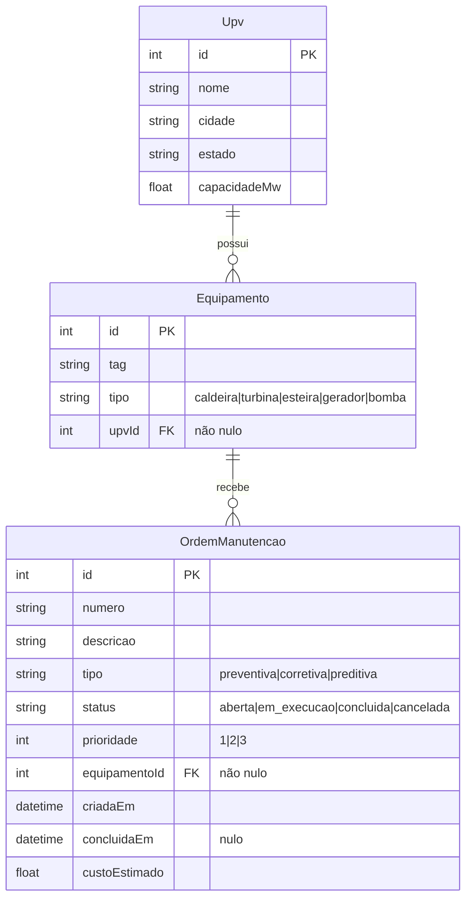

# Projeto — combio-manutencao

> Objetivo: registrar e acompanhar ordens de manutenção dos equipamentos das usinas (UPVs) da Combio.

## Escopo

- **Faz:**
  - Cadastro e consulta de UPVs (`nome`, `cidade`, `estado`, `capacidadeMw`) — `backend/src/upvs/`.
  - Cadastro de equipamentos por UPV (`tag`, `tipo`: caldeira, turbina, esteira, gerador, bomba) e listagem com filtro por UPV — `backend/src/equipamentos/`.
  - Abertura de ordens de manutenção (preventiva, corretiva, preditiva; prioridade 1 a 3; custo estimado), consulta, edição e mudança de status — `backend/src/ordens/`.
  - Interface web com lista filtrável, formulário de nova ordem, detalhe com troca de status — `frontend/src/app/ordens/`.
  - Documentação interativa da API (Swagger em `/api/docs`) — `backend/src/main.ts:17-23`.
  - Carga de dados sintéticos para desenvolvimento/aula — `backend/src/seed.ts`.
- **Não faz:**
  - Relatório de ordens por UPV: a tela existe, a rota da API não (ver [arquitetura.md, R4](arquitetura.md#7-qualidade-e-riscos)).
  - Validação de transição de status (ver [ADR 0006](adr/0006-maquina-de-estados-da-ordem.md)).
  - Exclusão de registros, edição de UPV/equipamento, paginação.
  - Autenticação, perfis de acesso, auditoria de quem alterou o quê.
  - Integração com ERP, estoque, compras ou apontamento de horas [a confirmar se existe em outro sistema].

O repositório também contém material de treinamento que **não faz parte do sistema em execução**: `aula/` (roteiro do lab, slides, hooks de exemplo), `.claude/`, `.github/skills/`, `.agents/` e os arquivos `AGENTS.md`/`CLAUDE.md` (instruções para agentes de IA).

## Partes interessadas

| Papel | Área / pessoa | Responsabilidade |
| --- | --- | --- |
| Dono de negócio | [a confirmar] | Prioridades e regras da manutenção das UPVs |
| Usuário-chave | [a confirmar] | Planejamento e execução de ordens |
| Sustentação técnica | [a confirmar] | Operação, correções, atualização de dependências |
| Material de aula | Hcode AI Team (organização do repositório remoto, `aula/LAB.md:19`) | Roteiro do lab e evolução didática |

## Módulos

| Módulo | Finalidade | Tecnologia | Documentação |
| --- | --- | --- | --- |
| `backend/src/upvs` | Usinas | NestJS + TypeORM | [arquitetura.md §3.1](arquitetura.md#31-componentes-da-api) |
| `backend/src/equipamentos` | Equipamentos por UPV | NestJS + TypeORM | [arquitetura.md §3.1](arquitetura.md#31-componentes-da-api) |
| `backend/src/ordens` | Ordens de manutenção e ciclo de status | NestJS + TypeORM | [arquitetura.md §4.1–4.2](arquitetura.md#4-fluxos-críticos-runtime) |
| `backend/src/config` | Configuração do TypeORM | TypeScript | [ADR 0001](adr/0001-sqlite-com-typeorm-synchronize.md) |
| `backend/src/seed.ts` | Carga de dados sintéticos | ts-node + TypeORM | [arquitetura.md §4.5](arquitetura.md#45-carga-de-dados-seed) |
| `frontend/src/app/ordens` | Lista, criação e detalhe de ordens | Angular 17 | [arquitetura.md §3.2](arquitetura.md#32-componentes-do-frontend) |
| `frontend/src/app/relatorio` | Relatório por UPV (sem backend) | Angular 17 | [arquitetura.md §4.4](arquitetura.md#44-relatório-de-ordens-por-upv) |
| `frontend/src/app/catalogo.service.ts` | HTTP de UPVs, equipamentos e relatório | Angular `HttpClient` | [ADR 0005](adr/0005-frontend-angular-standalone-com-servicos-http.md) |

Programas Progress/Datasul e processos Fluig: não se aplica (nenhum no repositório).

## Dependências

| Dependência | Versão | Uso | Evidência | Situação |
| --- | --- | --- | --- | --- |
| Node.js | >= 20 (CI: 24) | Runtime de backend, build e testes | `backend/package.json:6`, `.github/workflows/ci.yml:19` | 24 suportada; 20 em fim de vida [a confirmar política interna] |
| NestJS (`@nestjs/common`, `core`, `platform-express`) | ^11.2.5 | Framework da API | `backend/package.json:20-22` | suportada |
| `@nestjs/swagger` | ^11.4.7 | Documentação OpenAPI | `backend/package.json:23` | suportada |
| TypeORM / `@nestjs/typeorm` | ^0.3.31 / ^11.0.3 | ORM | `backend/package.json:24,30` | suportada |
| `better-sqlite3` | ^12.11.1 | Driver SQLite (binário nativo) | `backend/package.json:25` | suportada |
| `class-validator` / `class-transformer` | ^0.14.1 / ^0.5.1 | Validação de DTO | `backend/package.json:26-27` | suportada |
| `multer` (override) | ^2.4.0 | Forçado via `overrides` (dependência transitiva do Express) | `backend/package.json:32-34` | suportada; motivo do override [a confirmar] |
| TypeScript (backend) | ~6.0.3 | Compilação | `backend/package.json:57` | suportada |
| Jest / Supertest / ts-jest | ^29.7 / ^7.0 / ^29.2 | Testes unitários e e2e | `backend/package.json:49,52-53` | suportada |
| ESLint | ^8.57.1 | Lint (backend e frontend) | `backend/package.json:46`, `frontend/package.json:40` | fim de vida |
| Angular | ^17.3.12 | Framework do frontend | `frontend/package.json:14-21` | fim de vida |
| TypeScript (frontend) | ~5.4.5 | Compilação | `frontend/package.json:47` | amarrada ao Angular 17 |
| Karma + Jasmine | ~6.4 / ~5.1 | Testes do frontend em Chrome headless | `frontend/package.json:41-46` | Karma descontinuado pelo projeto |
| Google Chrome | qualquer recente | Execução dos testes do frontend | `README.md:13`, `frontend/karma.conf.js:34-39` | — |

## Como compilar, executar e implantar

Todos os comandos a partir da **raiz** do repositório (`package.json:6-13`):

```bash
npm run install:all     # cd backend && npm install && cd ../frontend && npm install
npm run seed            # APAGA e recria manutencao.sqlite com dados sintéticos
npm run start:backend   # nest start --watch  → http://localhost:3000, Swagger em /api/docs
npm run start:frontend  # ng serve            → http://localhost:4200 (outro terminal)
npm test                # backend (unit com cobertura + e2e) e frontend (Karma headless)
npm run lint            # backend usa --fix e ALTERA arquivos; frontend só verifica
```

Backend, dentro de `backend/` (`backend/package.json:8-18`):

```bash
npm run build           # nest build → dist/
npm run start:prod      # node dist/main
npm run test:unit       # jest (src/**/*.spec.ts)
npm run test:e2e        # jest --config ./test/jest-e2e.json (SQLite :memory:)
```

Frontend, dentro de `frontend/` (`frontend/package.json:5-12`): `npm run build` gera `dist/frontend` (`frontend/angular.json:15`).

Variáveis de ambiente lidas: somente `SQLITE_PATH` (padrão `manutencao.sqlite`, relativo ao diretório de execução) — `backend/src/config/database.config.ts:12`, `backend/src/seed.ts:102`.

CI: `.github/workflows/ci.yml` roda `npm ci`, `npm run lint` e `npm test` em cada projeto, e `npm run build` no frontend, em push e PR para `main`.

Implantação em servidor: não há script, container nem pipeline de deploy no repositório. [a confirmar] se o sistema é implantado em algum ambiente além do local.

Problemas comuns de instalação (PowerShell bloqueando scripts, `better-sqlite3` tentando compilar, porta em uso) estão descritos em `README.md:51-105`.

## Dados

| Banco / esquema | Conteúdo principal | Quem escreve | Retenção |
| --- | --- | --- | --- |
| `manutencao.sqlite` (SQLite, arquivo local; ignorado pelo git em `.gitignore:6`) | Tabelas `upv`, `equipamento`, `ordem_manutencao` [nomes gerados pelo TypeORM a partir das classes] | API (`POST`/`PATCH`) e `seed.ts` (apaga e recria) | Sem política; `npm run seed` descarta tudo |
| SQLite `:memory:` | Dados temporários dos testes e2e | `backend/test/*.e2e-spec.ts` | Duração do teste |

Modelo de dados (`backend/src/*/*.entity.ts`):



Dados de seed: 6 UPVs (SP, MG, GO), 5 equipamentos por UPV e 8 a 15 ordens por equipamento, com semente fixa `2026` (`backend/src/seed.ts:14,35-80,122-126`). O total exato de ordens é impresso ao fim do seed.

## Operação

| Rotina / job | Agenda | O que faz | Em caso de falha | Evidência |
| --- | --- | --- | --- | --- |
| Seed | Manual (`npm run seed`) | Apaga e recria o banco com dados sintéticos | Imprime o erro e sai com código 1 | `backend/src/seed.ts:162-165` |
| CI | Push e PR para `main` | Lint, testes com cobertura >= 80%, build do frontend | Pipeline falha; merge deve ser bloqueado [a confirmar regra de proteção de branch] | `.github/workflows/ci.yml` |

Não há jobs agendados, filas nem rotinas batch.

Logs e monitoração: a API escreve apenas o log padrão do Nest em stdout (subida, rotas mapeadas, exceções não tratadas). Não há arquivo de log, métricas, health check nem alertas.

## Riscos

Riscos de severidade alta (detalhes em [arquitetura.md §7](arquitetura.md#7-qualidade-e-riscos)):

- **R1** — Credencial de MySQL versionada em `backend/src/config/database.config.ts:6-7`. Rotacionar e remover.
- **R2** — Status da ordem sem validação de transição; `concluidaEm` sobrescrita por `PATCH /ordens/:id/status`.
- **R3** — API sem autenticação e com CORS aberto.

## Pendências

- [a confirmar] Quem são os usuários do sistema e quantos são? — quem responde: dono de negócio.
- [a confirmar] O sistema roda em algum ambiente além do local/aula (homologação, produção)? Em qual servidor? — quem responde: operação/infra.
- [a confirmar] O banco MySQL referenciado em `LEGACY_MYSQL_URL` existe e está ativo? A senha já foi rotacionada? — quem responde: operação/infra e segurança.
- [a confirmar] Qual a tabela de transições de status aceita pelo negócio (a proposta está em `aula/LAB.md:252-263`)? — quem responde: usuário-chave de manutenção.
- [a confirmar] Significado da sigla UPV. — quem responde: dono de negócio.
- [a confirmar] Semântica da prioridade (1 = alta?). O código não define; `aula/LAB.md:98` diz "1 (alta) a 3 (baixa)". — quem responde: usuário-chave.
- [a confirmar] Moeda do `custoEstimado` (a tela formata em BRL, `frontend/src/app/ordens/ordem-detalhe.component.ts:21`). — quem responde: usuário-chave.
- [a confirmar] O relatório por UPV deve ser implementado no backend ou a tela removida? — quem responde: dono de negócio.
- [a confirmar] Motivo da dependência `"combio-manutencao": "file:.."` no frontend e do override de `multer`. — quem responde: time de desenvolvimento.
- [a confirmar] Há previsão para a migração MySQL descrita em `docs/NOTAS_MIGRACAO.md`? — quem responde: time de desenvolvimento.
